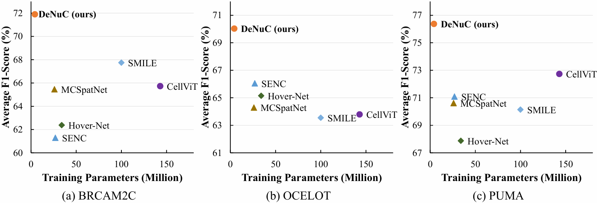

# DeNuC: Decoupling Nuclei Detection and Classification in Histopathology

<div align="center">

<a href='https://arxiv.org/abs/2603.04240'></a>
<a href='https://github.com/ZijiangY1116/DeNuC'></a>
<a href='https://huggingface.co/datasets/ZijiangY/DeNuC'></a>

</div>

This is the official code repository for the paper "DeNuC: Decoupling Nuclei Detection and Classification in Histopathology".

<div  align="center">    

</div>

In this work, we reveal that jointly optimizing nuclei detection and classification leads to severe representation degradation in FMs. Moreover, we identify that the substantial intrinsic disparity in task difficulty between nuclei detection and nuclei classification renders joint NDC optimization unnecessarily computationally burdensome for the detection stage. To address these challenges, we propose **DeNuC**, a simple yet effective method designed to break through existing bottlenecks by **De**coupling **Nu**clei detection and **C**lassification. DeNuC employs a lightweight model for accurate nuclei localization, subsequently leveraging a pathology FM to encode input images and query nucleus-specific features based on the detected coordinates for classification. Extensive experiments on three widely used benchmarks demonstrate that DeNuC effectively unlocks the representational potential of FMs for NDC and significantly outperforms state-of-the-art methods. Notably, DeNuC improves F1 scores by 4.2% and 3.6% (or higher) on the BRCAM2C and PUMA datasets, respectively, while using only 16% (or fewer) trainable parameters compared to other methods.

## Environment Setup

The code is developed and tested using Python 3.10. We recommend using `conda` to create a environment and install the required dependencies. Below are the steps to set up the environment:
```bash
conda create -n denuc python=3.10
conda activate denuc

# install uv
pip install uv
# Torch2.8.0 + CUDA128
uv pip install torch==2.8.0 torchvision==0.23.0 torchaudio==2.8.0

# other requirements
uv pip install -r requirements.txt
```

## Data Preparation

You can download the preprocessed datasets from [DeNuC (HuggingFace)](https://huggingface.co/datasets/ZijiangY/DeNuC).
In addition, you can also download the raw datasets from the original sources and prepare the datasets by yourself using the following commands.
The preprocessed datasets will be saved in the `./dataset/` folder by default.

* PUMA

Please download and unzip the PUMA (V5) dataset from [here](https://zenodo.org/records/15050523). 
Then, you can use the following command to prepare the dataset for training and evaluation:
```bash
python ./preprocess/puma.py --puma_folder /path/to/PUMA/folder/ --output_folder ./dataset/puma/
```

* BRCAM2C

Please download and unzip the BRCAM2C dataset from [here](https://github.com/TopoXLab/Dataset-BRCA-M2C).
Please note that we crop the patches from the WSIs, so you also need to download the WSIs from TCGA.
Then, you can use the following command to prepare the dataset for training and evaluation:
```bash
python ./preprocess/brcam2c.py --brcam2c_folder /path/to/BRCAM2C/folder/ --output_folder ./dataset/brcam2c/ --wsi_folder /path/to/WSI/folder/
```

* OCELOT

Please download and unzip the OCELOT dataset from [here](https://zenodo.org/records/8417503). 
Then, you can use the following command to prepare the dataset for training and evaluation:
```bash
python ./preprocess/ocelot.py --ocelot_folder /path/to/OCELOT/folder/ --output_folder ./dataset/ocelot/
```

## Pre-trained Models

The pre-trained models of DeNuC are available at [DeNuC (HuggingFace)](https://huggingface.co/datasets/ZijiangY/DeNuC).

<table>
    <thead>
        <tr>
            <th rowspan="2" style="text-align: center; vertical-align: middle;">Backbone</th>
            <th rowspan="2" style="text-align: center; vertical-align: middle;">Weight Link</th>
            <th rowspan="2" style="text-align: center; vertical-align: middle;">Params.</th>
            <th colspan="2" style="text-align: center;">BRCAM2C</th>
            <th colspan="2" style="text-align: center;">OCELOT</th>
            <th colspan="2" style="text-align: center;">PUMA</th>
        </tr>
        <tr>
            <th style="text-align: center;"><i>F</i><sup>Det.</sup></th>
            <th style="text-align: center;"><i>F</i><sup>Avg.</sup></th>
            <th style="text-align: center;"><i>F</i><sup>Det.</sup></th>
            <th style="text-align: center;"><i>F</i><sup>Avg.</sup></th>
            <th style="text-align: center;"><i>F</i><sup>Det.</sup></th>
            <th style="text-align: center;"><i>F</i><sup>Avg.</sup></th>
        </tr>
    </thead>
    <tbody>
        <tr>
            <td style="text-align: center;">SN (0.5&times;)</td>
            <td style="text-align: center;"><a href="https://huggingface.co/datasets/ZijiangY/DeNuC/blob/main/pretrained/SN_0_5/best_checkpoint.pth">Download</a></td>
            <td style="text-align: center;">0.3M</td>
            <td style="text-align: center;">86.61</td>
            <td style="text-align: center;">71.43</td>
            <td style="text-align: center;">79.89</td>
            <td style="text-align: center;">68.85</td>
            <td style="text-align: center;">92.23</td>
            <td style="text-align: center;">75.45</td>
        </tr>
        <tr>
            <td style="text-align: center;">SN (1.0&times;)</td>
            <td style="text-align: center;"><a href="https://huggingface.co/datasets/ZijiangY/DeNuC/blob/main/pretrained/SN_1_0/best_checkpoint.pth">Download</a></td>
            <td style="text-align: center;">1.0M</td>
            <td style="text-align: center;">86.98</td>
            <td style="text-align: center;">71.58</td>
            <td style="text-align: center;">80.97</td>
            <td style="text-align: center;">69.74</td>
            <td style="text-align: center;">93.13</td>
            <td style="text-align: center;">75.98</td>
        </tr>
        <tr>
            <td style="text-align: center;">SN (1.5&times;)</td>
            <td style="text-align: center;"><a href="https://huggingface.co/datasets/ZijiangY/DeNuC/blob/main/pretrained/SN_1_5/best_checkpoint.pth">Download</a></td>
            <td style="text-align: center;">2.7M</td>
            <td style="text-align: center;">87.00</td>
            <td style="text-align: center;">71.90</td>
            <td style="text-align: center;">81.07</td>
            <td style="text-align: center;">69.76</td>
            <td style="text-align: center;">93.28</td>
            <td style="text-align: center;">76.19</td>
        </tr>
        <tr>
            <td style="text-align: center;">SN (2.0&times;)</td>
            <td style="text-align: center;"><a href="https://huggingface.co/datasets/ZijiangY/DeNuC/blob/main/pretrained/SN_2_0/best_checkpoint.pth">Download</a></td>
            <td style="text-align: center;">4.3M</td>
            <td style="text-align: center;">87.52</td>
            <td style="text-align: center;">71.97</td>
            <td style="text-align: center;">81.33</td>
            <td style="text-align: center;">69.94</td>
            <td style="text-align: center;">93.57</td>
            <td style="text-align: center;">76.37</td>
        </tr>
        <tr>
            <td style="text-align: center;">ResNet-50</td>
            <td style="text-align: center;"><a href="https://huggingface.co/datasets/ZijiangY/DeNuC/blob/main/pretrained/R50/best_checkpoint.pth">Download</a></td>
            <td style="text-align: center;">26M</td>
            <td style="text-align: center;">87.29</td>
            <td style="text-align: center;">71.90</td>
            <td style="text-align: center;">81.48</td>
            <td style="text-align: center;">70.03</td>
            <td style="text-align: center;">93.22</td>
            <td style="text-align: center;">76.07</td>
        </tr>
    </tbody>
</table>

## Quick Start

### Nuclei Detection

To train the DeNuC model for nuclei detection, you can use the following command:
```bash
python ./denuc_train.py --arch denuc_det_shufflenet_x2_0
```

This command train the DeNuC on the mixed dataset of PUMA, BRCAM2C, and OCELOT. After training, the script will automatically evaluate the model on validation set to select the best checkpoint. The test evaluation will be performed on each dataset using the best checkpoint.

You can also specify the training dataset by using the `--datasets` argument. For example, if you only want to train on the PUMA dataset, you can use the following command:
```bash
python ./denuc_train.py --arch denuc_det_shufflenet_x2_0 --datasets puma
```

The evaluation can also be performed on a specific dataset:
```bash
python ./denuc_eval.py --exp_name ${train_exp_name} --eval_dataset ${dataset_name} --eval_mode ${mode} --nms_dist ${eval_nms}
```
where `train_exp_name` is the name of the training experiment, `dataset_name` is the name of the dataset to evaluate on, `mode` is either `val` or `test`, and `eval_nms` is the NMS distance threshold for evaluation (by default, it is set to 12.0 pixels).

**Note**: Training and validation are both based on the preprocessed data. For the test set, we perform sliding-window inference on the original images to achieve a more accurate evaluation.

### Nuclei Classification

After training the DeNuC model for nuclei detection, you can use the following command to reproduce the main results:
```bash
bash ./scripts/single_dataset_cls_train.sh -i ${GPU_ID} --exp_name ${EXP_NAME} --det_exp_name ${DET_EXP_NAME} --dataset ${DATASET_NAME}
```
where `GPU_ID` is the ID of the GPU to use, `EXP_NAME` is the name of the classification experiment, `DET_EXP_NAME` is the name of the detection experiment (i.e., the training experiment output folder for the DeNuC model), and `DATASET_NAME` is the name of the dataset to train and test on (e.g., `puma`, `brcam2c`, or `ocelot`).

**Note**: The pretrained UNI2-H is required for training the classification model. You can download the pretrained UNI2-H from [here](https://github.com/mahmoodlab/UNI). After downloading the pretrained UNI2-H, please specify the path to the pretrained model in the `./utils/foundation_models/uni2_h.py (line 24)` before training the classification model.

## Results

### BRCAM2C

| Method | Training Params. | $F^{Lym.}$ | $F^{Tum.}$ | $F^{Oth.}$ | $F^{Avg.}$ |
| :--- | :--- | :--- | :--- | :--- | :--- |
| DeNuC (ours) | 4.3M | 69.73 | 85.10 | 61.08 | 71.97 |

### OCELOT

| Method | Training Params. | $F^{Tum.}$ | $F^{Oth.}$ | $F^{Avg.}$ |
| :--- | :--- | :--- | :--- | :--- |
| DeNuC (ours) | 4.3M | 73.83 | 66.04 | 69.94 |

### PUMA

| Method | Training Params. | $F^{Lym.}$ | $F^{Tum.}$ | $F^{Oth.}$ | $F^{Avg.}$ |
| :--- | :--- | :--- | :--- | :--- | :--- |
| DeNuC (ours) | 4.3M | 81.00 | 85.25 | 62.85 | 76.37 |

## License

The code is released under the Apache 2.0 license as found in the [LICENSE](./LICENSE) file.
The preprocessed datasets are released under their respective licenses.
