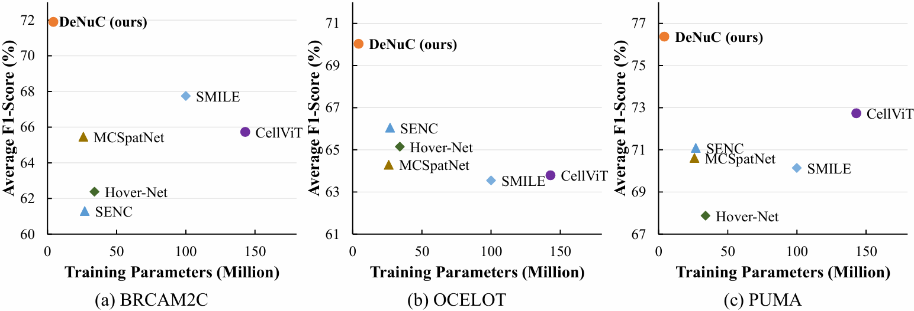

# DeNuC: Decoupling Nuclei Detection and Classification in Histopathology

This is the official code repository for the paper "DeNuC: Decoupling Nuclei Detection and Classification in Histopathology".

<div  align="center">    

</div>

In this work, we reveal that jointly optimizing nuclei detection and classification leads to severe representation degradation in FMs. Moreover, we identify that the substantial intrinsic disparity in task difficulty between nuclei detection and nuclei classification renders joint NDC optimization unnecessarily computationally burdensome for the detection stage. To address these challenges, we propose **DeNuC**, a simple yet effective method designed to break through existing bottlenecks by **De**coupling **Nu**clei detection and **C**lassification. DeNuC employs a lightweight model for accurate nuclei localization, subsequently leveraging a pathology FM to encode input images and query nucleus-specific features based on the detected coordinates for classification. Extensive experiments on three widely used benchmarks demonstrate that DeNuC effectively unlocks the representational potential of FMs for NDC and significantly outperforms state-of-the-art methods. Notably, DeNuC improves F1 scores by 4.2% and 3.6% (or higher) on the BRCAM2C and PUMA datasets, respectively, while using only 16% (or fewer) trainable parameters compared to other methods.

## News

- ✨️ **[2026-07]**: Supported [fast whole-image nuclei inference](#whole-image-inference) for arbitrary H&E images. Enable WSI-level nuclei detection in only a few minutes without any preprocessing. ⚡
- ✨️ **[2026-06]**: Completed nuclei detection training on a new dataset that [combines multiple public datasets](#enhanced-detection-model), followed by [comprehensive performance evaluation and OOD experiments](#pre-trained-models-and-results). 🔬 Stronger, more robust, and more general-purpose nuclei detection models.💪💪💪
- ✨️ **[2026-05]**: Accepted to MICCAI 2026 [Early Accept]! 🎉🎉🎉
- ✨️ **[2026-03]**: Release the training code, pre-trained weights, and evaluation code. 🚀

## Environment Setup

The code is developed and tested using Python 3.10. We recommend using `conda` to create a environment and install the required dependencies. Below are the steps to set up the environment:
```bash
conda create -n denuc python=3.10
conda activate denuc

# install uv
pip install uv
# Torch2.8.0 + CUDA128
uv pip install torch==2.8.0 torchvision==0.23.0 torchaudio==2.8.0

# other requirements
uv pip install -r requirements.txt
```

## Data Preparation

You can download the preprocessed datasets from [DeNuC (HuggingFace)](https://huggingface.co/datasets/ZijiangY/DeNuC).
In addition, you can also download the raw datasets from the original sources and prepare the datasets by yourself using the following commands.
The preprocessed datasets will be saved in the `./dataset/` folder by default.

* PUMA

Please download and unzip the PUMA (V5) dataset from [here](https://zenodo.org/records/15050523). 
Then, you can use the following command to prepare the dataset for training and evaluation:
```bash
python ./preprocess/puma.py --puma_folder /path/to/PUMA/folder/ --output_folder ./dataset/puma/
```

* BRCAM2C

Please download and unzip the BRCAM2C dataset from [here](https://github.com/TopoXLab/Dataset-BRCA-M2C).
Please note that we crop the patches from the WSIs, so you also need to download the WSIs from TCGA.
Then, you can use the following command to prepare the dataset for training and evaluation:
```bash
python ./preprocess/brcam2c.py --brcam2c_folder /path/to/BRCAM2C/folder/ --output_folder ./dataset/brcam2c/ --wsi_folder /path/to/WSI/folder/
```

* OCELOT

Please download and unzip the OCELOT dataset from [here](https://zenodo.org/records/8417503). 
Then, you can use the following command to prepare the dataset for training and evaluation:
```bash
python ./preprocess/ocelot.py --ocelot_folder /path/to/OCELOT/folder/ --output_folder ./dataset/ocelot/
```

## Pre-trained Models and Results

The pre-trained models of DeNuC are available at [DeNuC (HuggingFace)](https://huggingface.co/datasets/ZijiangY/DeNuC).

### Paper Version

<table>
    <thead>
        <tr>
            <th rowspan="2" style="text-align: center; vertical-align: middle;">Backbone</th>
            <th rowspan="2" style="text-align: center; vertical-align: middle;">Version</th>
            <th rowspan="2" style="text-align: center; vertical-align: middle;">Weight Link</th>
            <th rowspan="2" style="text-align: center; vertical-align: middle;">Params.</th>
            <th colspan="2" style="text-align: center;">BRCAM2C</th>
            <th colspan="2" style="text-align: center;">OCELOT</th>
            <th colspan="2" style="text-align: center;">PUMA</th>
        </tr>
        <tr>
            <th style="text-align: center;"><i>F</i><sup>Det.</sup></th>
            <th style="text-align: center;"><i>F</i><sup>Avg.</sup></th>
            <th style="text-align: center;"><i>F</i><sup>Det.</sup></th>
            <th style="text-align: center;"><i>F</i><sup>Avg.</sup></th>
            <th style="text-align: center;"><i>F</i><sup>Det.</sup></th>
            <th style="text-align: center;"><i>F</i><sup>Avg.</sup></th>
        </tr>
    </thead>
    <tbody>
        <tr>
            <td style="text-align: center;">SN (0.5&times;)</td>
            <td style="text-align: center;">Paper Version</td>
            <td style="text-align: center;"><a href="https://huggingface.co/datasets/ZijiangY/DeNuC/blob/main/pretrained/SN_0_5/best_checkpoint.pth">Download</a></td>
            <td style="text-align: center;">0.3M</td>
            <td style="text-align: center;">86.61</td>
            <td style="text-align: center;">71.43</td>
            <td style="text-align: center;">79.89</td>
            <td style="text-align: center;">68.85</td>
            <td style="text-align: center;">92.23</td>
            <td style="text-align: center;">75.45</td>
        </tr>
        <tr>
            <td style="text-align: center;">SN (1.0&times;)</td>
            <td style="text-align: center;">Paper Version</td>
            <td style="text-align: center;"><a href="https://huggingface.co/datasets/ZijiangY/DeNuC/blob/main/pretrained/SN_1_0/best_checkpoint.pth">Download</a></td>
            <td style="text-align: center;">1.0M</td>
            <td style="text-align: center;">86.98</td>
            <td style="text-align: center;">71.58</td>
            <td style="text-align: center;">80.97</td>
            <td style="text-align: center;">69.74</td>
            <td style="text-align: center;">93.13</td>
            <td style="text-align: center;">75.98</td>
        </tr>
        <tr>
            <td style="text-align: center;">SN (1.5&times;)</td>
            <td style="text-align: center;">Paper Version</td>
            <td style="text-align: center;"><a href="https://huggingface.co/datasets/ZijiangY/DeNuC/blob/main/pretrained/SN_1_5/best_checkpoint.pth">Download</a></td>
            <td style="text-align: center;">2.7M</td>
            <td style="text-align: center;">87.00</td>
            <td style="text-align: center;">71.90</td>
            <td style="text-align: center;">81.07</td>
            <td style="text-align: center;">69.76</td>
            <td style="text-align: center;">93.28</td>
            <td style="text-align: center;">76.19</td>
        </tr>
        <tr>
            <td style="text-align: center;">SN (2.0&times;)</td>
            <td style="text-align: center;">Paper Version</td>
            <td style="text-align: center;"><a href="https://huggingface.co/datasets/ZijiangY/DeNuC/blob/main/pretrained/SN_2_0/best_checkpoint.pth">Download</a></td>
            <td style="text-align: center;">4.3M</td>
            <td style="text-align: center;">87.52</td>
            <td style="text-align: center;">71.97</td>
            <td style="text-align: center;">81.33</td>
            <td style="text-align: center;">69.94</td>
            <td style="text-align: center;">93.57</td>
            <td style="text-align: center;">76.36</td>
        </tr>
        <tr>
            <td style="text-align: center;">ResNet-50</td>
            <td style="text-align: center;">Paper Version</td>
            <td style="text-align: center;"><a href="https://huggingface.co/datasets/ZijiangY/DeNuC/blob/main/pretrained/R50/best_checkpoint.pth">Download</a></td>
            <td style="text-align: center;">26M</td>
            <td style="text-align: center;">87.29</td>
            <td style="text-align: center;">71.90</td>
            <td style="text-align: center;">81.48</td>
            <td style="text-align: center;">70.03</td>
            <td style="text-align: center;">93.22</td>
            <td style="text-align: center;">76.07</td>
        </tr>
    </tbody>
</table>

#### Detection and Classification (SN 2.0x)
* BRCAM2C

| Method | Training Params. | $F^{Lym.}$ | $F^{Tum.}$ | $F^{Oth.}$ | $F^{Avg.}$ |
| :--- | :--- | :--- | :--- | :--- | :--- |
| DeNuC (ours) | 4.3M | 69.73 | 85.10 | 61.08 | 71.97 |

* OCELOT

| Method | Training Params. | $F^{Tum.}$ | $F^{Oth.}$ | $F^{Avg.}$ |
| :--- | :--- | :--- | :--- | :--- |
| DeNuC (ours) | 4.3M | 73.83 | 66.04 | 69.94 |

* PUMA

| Method | Training Params. | $F^{Lym.}$ | $F^{Tum.}$ | $F^{Oth.}$ | $F^{Avg.}$ |
| :--- | :--- | :--- | :--- | :--- | :--- |
| DeNuC (ours) | 4.3M | 81.00 | 85.25 | 62.85 | 76.37 |

### OOD Detection Results
Paper Version checkpoints are trained only on the original BRCAM2C, OCELOT, and PUMA detection datasets, then directly evaluated on the additional datasets introduced in the [Enhanced Detection Model](#enhanced-detection-model) section. BRCAM2C, OCELOT, and PUMA are omitted here because they are in-domain datasets for the Paper Version models. The `Evaluation` column follows the same rule as below: datasets used only for testing are marked as `OOD`; datasets with an official test split are marked as `Test Set (OOD)`, meaning the Paper Version model is evaluated out-of-distribution on their test set. For datasets with a test set, only the test set is used; otherwise, the whole dataset is used.

<table>
    <thead>
        <tr>
            <th style="text-align: center; vertical-align: middle;">Dataset</th>
            <th style="text-align: center; vertical-align: middle;">Evaluation</th>
            <th style="text-align: center; vertical-align: middle;">SN (0.5&times;)</th>
            <th style="text-align: center; vertical-align: middle;">SN (1.0&times;)</th>
            <th style="text-align: center; vertical-align: middle;">SN (1.5&times;)</th>
            <th style="text-align: center; vertical-align: middle;">SN (2.0&times;)</th>
            <th style="text-align: center; vertical-align: middle;">ResNet-50</th>
        </tr>
    </thead>
    <tbody>
        <tr>
            <td style="text-align: center;">CPM-17</td>
            <td style="text-align: center;">Test Set (OOD)</td>
            <td style="text-align: center;">87.69</td>
            <td style="text-align: center;">88.53</td>
            <td style="text-align: center;">88.45</td>
            <td style="text-align: center;">88.94</td>
            <td style="text-align: center;">89.19</td>
        </tr>
        <tr>
            <td style="text-align: center;">Kumar</td>
            <td style="text-align: center;">Test Set (OOD)</td>
            <td style="text-align: center;">83.45</td>
            <td style="text-align: center;">84.53</td>
            <td style="text-align: center;">85.74</td>
            <td style="text-align: center;">85.03</td>
            <td style="text-align: center;">85.34</td>
        </tr>
        <tr>
            <td style="text-align: center;">CoNSeP</td>
            <td style="text-align: center;">Test Set (OOD)</td>
            <td style="text-align: center;">61.57</td>
            <td style="text-align: center;">64.06</td>
            <td style="text-align: center;">65.45</td>
            <td style="text-align: center;">66.37</td>
            <td style="text-align: center;">65.50</td>
        </tr>
        <tr>
            <td style="text-align: center;">PanNuke (Fold 1)</td>
            <td style="text-align: center;">Test Set (OOD)</td>
            <td style="text-align: center;">75.19</td>
            <td style="text-align: center;">76.74</td>
            <td style="text-align: center;">78.48</td>
            <td style="text-align: center;">78.36</td>
            <td style="text-align: center;">77.90</td>
        </tr>
        <tr>
            <td style="text-align: center;">PanNuke (Fold 2)</td>
            <td style="text-align: center;">Test Set (OOD)</td>
            <td style="text-align: center;">74.00</td>
            <td style="text-align: center;">75.57</td>
            <td style="text-align: center;">77.55</td>
            <td style="text-align: center;">77.26</td>
            <td style="text-align: center;">76.59</td>
        </tr>
        <tr>
            <td style="text-align: center;">PanNuke (Fold 3)</td>
            <td style="text-align: center;">Test Set (OOD)</td>
            <td style="text-align: center;">74.01</td>
            <td style="text-align: center;">75.90</td>
            <td style="text-align: center;">77.80</td>
            <td style="text-align: center;">77.66</td>
            <td style="text-align: center;">76.89</td>
        </tr>
        <tr>
            <td style="text-align: center;">CPM-15</td>
            <td style="text-align: center;">OOD</td>
            <td style="text-align: center;">71.70</td>
            <td style="text-align: center;">72.36</td>
            <td style="text-align: center;">74.18</td>
            <td style="text-align: center;">73.33</td>
            <td style="text-align: center;">71.95</td>
        </tr>
        <tr>
            <td style="text-align: center;">CryoNuSeg</td>
            <td style="text-align: center;">OOD</td>
            <td style="text-align: center;">61.56</td>
            <td style="text-align: center;">62.43</td>
            <td style="text-align: center;">64.10</td>
            <td style="text-align: center;">63.85</td>
            <td style="text-align: center;">63.42</td>
        </tr>
        <tr>
            <td style="text-align: center;">TNBC</td>
            <td style="text-align: center;">OOD</td>
            <td style="text-align: center;">83.22</td>
            <td style="text-align: center;">85.92</td>
            <td style="text-align: center;">87.42</td>
            <td style="text-align: center;">87.50</td>
            <td style="text-align: center;">86.13</td>
        </tr>
    </tbody>
</table>

### Enhanced Version (V2)

V2 models are trained with more compatible detection datasets introduced in the [Enhanced Detection Model](#enhanced-detection-model) section, including BRCAM2C, OCELOT, PUMA, CPM15, CPM17, TNBC, Kumar, CoNSeP, CryoNuSeg, and PanNuke. These checkpoints are intended for stronger and broader nuclei detection, especially for OOD-style evaluation across heterogeneous pathology datasets.

The `Evaluation` column distinguishes normal test-set evaluation from OOD-only evaluation: datasets with standard train/validation/test usage are marked as `Test Set`, while datasets reserved only for testing are marked as `OOD`. The following table reports detection performance only.

<table>
    <thead>
        <tr>
            <th rowspan="2" style="text-align: center; vertical-align: middle;">Dataset</th>
            <th rowspan="2" style="text-align: center; vertical-align: middle;">Evaluation</th>
            <th style="text-align: center; vertical-align: middle;">SN (0.5&times;)</th>
            <th style="text-align: center; vertical-align: middle;">SN (1.0&times;)</th>
            <th style="text-align: center; vertical-align: middle;">SN (1.5&times;)</th>
            <th style="text-align: center; vertical-align: middle;">SN (2.0&times;)</th>
            <th style="text-align: center; vertical-align: middle;">ResNet-50</th>
        </tr>
        <tr>
            <th style="text-align: center;"><a href="https://huggingface.co/datasets/ZijiangY/DeNuC/blob/main/pretrained-V2/SN_0_5-V2/best_checkpoint.pth">Download</a></th>
            <th style="text-align: center;"><a href="https://huggingface.co/datasets/ZijiangY/DeNuC/blob/main/pretrained-V2/SN_1_0-V2/best_checkpoint.pth">Download</a></th>
            <th style="text-align: center;"><a href="https://huggingface.co/datasets/ZijiangY/DeNuC/blob/main/pretrained-V2/SN_1_5-V2/best_checkpoint.pth">Download</a></th>
            <th style="text-align: center;"><a href="https://huggingface.co/datasets/ZijiangY/DeNuC/blob/main/pretrained-V2/SN_2_0-V2/best_checkpoint.pth">Download</a></th>
            <th style="text-align: center;"><a href="https://huggingface.co/datasets/ZijiangY/DeNuC/blob/main/pretrained-V2/R50-V2/best_checkpoint.pth">Download</a></th>
        </tr>
    </thead>
    <tbody>
        <tr>
            <td style="text-align: center;">BRCAM2C</td>
            <td style="text-align: center;">Test Set</td>
            <td style="text-align: center;">86.42</td>
            <td style="text-align: center;">87.24</td>
            <td style="text-align: center;">86.68</td>
            <td style="text-align: center;">86.95</td>
            <td style="text-align: center;">86.79</td>
        </tr>
        <tr>
            <td style="text-align: center;">OCELOT</td>
            <td style="text-align: center;">Test Set</td>
            <td style="text-align: center;">79.75</td>
            <td style="text-align: center;">81.64</td>
            <td style="text-align: center;">81.33</td>
            <td style="text-align: center;">81.65</td>
            <td style="text-align: center;">81.31</td>
        </tr>
        <tr>
            <td style="text-align: center;">PUMA</td>
            <td style="text-align: center;">Test Set</td>
            <td style="text-align: center;">92.47</td>
            <td style="text-align: center;">93.22</td>
            <td style="text-align: center;">93.48</td>
            <td style="text-align: center;">93.85</td>
            <td style="text-align: center;">93.44</td>
        </tr>
        <tr>
            <td style="text-align: center;">CPM-17</td>
            <td style="text-align: center;">Test Set</td>
            <td style="text-align: center;">89.84</td>
            <td style="text-align: center;">90.92</td>
            <td style="text-align: center;">90.94</td>
            <td style="text-align: center;">91.07</td>
            <td style="text-align: center;">91.06</td>
        </tr>
        <tr>
            <td style="text-align: center;">Kumar</td>
            <td style="text-align: center;">Test Set</td>
            <td style="text-align: center;">85.97</td>
            <td style="text-align: center;">87.94</td>
            <td style="text-align: center;">87.78</td>
            <td style="text-align: center;">88.04</td>
            <td style="text-align: center;">88.47</td>
        </tr>
        <tr>
            <td style="text-align: center;">CoNSeP</td>
            <td style="text-align: center;">Test Set</td>
            <td style="text-align: center;">75.99</td>
            <td style="text-align: center;">78.05</td>
            <td style="text-align: center;">78.68</td>
            <td style="text-align: center;">78.78</td>
            <td style="text-align: center;">79.50</td>
        </tr>
        <tr>
            <td style="text-align: center;">PanNuke (Fold 3)</td>
            <td style="text-align: center;">Test Set</td>
            <td style="text-align: center;">82.40</td>
            <td style="text-align: center;">84.81</td>
            <td style="text-align: center;">85.43</td>
            <td style="text-align: center;">85.74</td>
            <td style="text-align: center;">85.47</td>
        </tr>
        <tr>
            <td style="text-align: center;">CPM-15</td>
            <td style="text-align: center;">OOD</td>
            <td style="text-align: center;">82.29</td>
            <td style="text-align: center;">82.54</td>
            <td style="text-align: center;">83.32</td>
            <td style="text-align: center;">83.07</td>
            <td style="text-align: center;">83.54</td>
        </tr>
        <tr>
            <td style="text-align: center;">CryoNuSeg</td>
            <td style="text-align: center;">OOD</td>
            <td style="text-align: center;">66.73</td>
            <td style="text-align: center;">69.22</td>
            <td style="text-align: center;">70.21</td>
            <td style="text-align: center;">70.30</td>
            <td style="text-align: center;">69.61</td>
        </tr>
        <tr>
            <td style="text-align: center;">TNBC</td>
            <td style="text-align: center;">OOD</td>
            <td style="text-align: center;">88.65</td>
            <td style="text-align: center;">90.10</td>
            <td style="text-align: center;">90.06</td>
            <td style="text-align: center;">90.49</td>
            <td style="text-align: center;">89.93</td>
        </tr>
    </tbody>
</table>

## Quick Start

### Nuclei Detection

To train the DeNuC model for nuclei detection, you can use the following command:
```bash
python ./denuc_train.py --arch denuc_det_shufflenet_x2_0
```

This command train the DeNuC on the mixed dataset of PUMA, BRCAM2C, and OCELOT. After training, the script will automatically evaluate the model on validation set to select the best checkpoint. The test evaluation will be performed on each dataset using the best checkpoint.

You can also specify the training dataset by using the `--datasets` argument. For example, if you only want to train on the PUMA dataset, you can use the following command:
```bash
python ./denuc_train.py --arch denuc_det_shufflenet_x2_0 --datasets puma
```

The evaluation can also be performed on a specific dataset:
```bash
python ./denuc_eval.py --exp_name ${train_exp_name} --eval_dataset ${dataset_name} --eval_mode ${mode} --nms_dist ${eval_nms}
```
where `train_exp_name` is the name of the training experiment, `dataset_name` is the name of the dataset to evaluate on, `mode` is either `val` or `test`, and `eval_nms` is the NMS distance threshold for evaluation (by default, it is set to 12.0 pixels).

**Note**: Training and validation are both based on the preprocessed data. For the test set, we perform sliding-window inference on the original images to achieve a more accurate evaluation.

### Nuclei Classification

After training the DeNuC model for nuclei detection, you can use the following command to reproduce the main results:
```bash
bash ./scripts/single_dataset_cls_train.sh -i ${GPU_ID} --exp_name ${EXP_NAME} --det_exp_name ${DET_EXP_NAME} --dataset ${DATASET_NAME}
```
where `GPU_ID` is the ID of the GPU to use, `EXP_NAME` is the name of the classification experiment, `DET_EXP_NAME` is the name of the detection experiment (i.e., the training experiment output folder for the DeNuC model), and `DATASET_NAME` is the name of the dataset to train and test on (e.g., `puma`, `brcam2c`, or `ocelot`).

**Note**: The pretrained UNI2-H is required for training the classification model. You can download the pretrained UNI2-H from [here](https://github.com/mahmoodlab/UNI). After downloading the pretrained UNI2-H, please specify the path to the pretrained model in the `./utils/foundation_models/uni2_h.py (line 24)` before training the classification model.

## Enhanced Detection Model

### Additional detection/OOD datasets

To improve detection robustness and support broader OOD evaluation, we extend
the original BRCAM2C/OCELOT/PUMA setup with seven additional nuclei detection
datasets. Their basic information is summarized in the following table.

| Dataset | Source | Paper | License |
| :--- | :--- | :--- | :--- |
| [CPM-15](https://drive.google.com/drive/folders/11ko-GcDsPpA9GBHuCtl_jNzWQl6qY_-I) | TCGA | Methods for Segmentation and Classification of Digital Microscopy Tissue Images | MIT License |
| [CPM-17](https://drive.google.com/drive/folders/1sJ4nmkif6j4s2FOGj8j6i_Ye7z9w0TfA) | TCGA | Methods for Segmentation and Classification of Digital Microscopy Tissue Images | MIT License |
| [TNBC (V1.1)](https://zenodo.org/records/2579118) | Curie Institute | Segmentation of Nuclei in Histopathology Images by Deep Regression of the Distance Map | CC BY 4.0 |
| [Kumar](https://drive.google.com/drive/folders/1bI3RyshWej9c4YoRW-_q7lh7FOFDFUrJ) | TCGA | A Dataset and a Technique for Generalized Nuclear Segmentation for Computational Pathology | N/A |
| [CoNSeP](https://warwick.ac.uk/TIA/data/hovernet/) | UHCW | HoVer-Net: Simultaneous Segmentation and Classification of Nuclei in Multi-Tissue Histology Images | MIT License |
| [CryoNuSeg](https://github.com/masih4/CryoNuSeg) | TCGA | CryoNuSeg: A Dataset for Nuclei Instance Segmentation of Cryosectioned H&E-Stained Histological Images | MIT License |
| [PanNuke](https://warwick.ac.uk/fac/cross_fac/tia/data/pannuke) | Mixed (mainly TCGA) | PanNuke: An Open Pan-Cancer Histology Dataset for Nuclei Instance Segmentation and Classification | CC BY-NC-SA 4.0 |

### Pre-processing scripts for additional datasets

All datasets are stored as non-overlapping 40x `256x256` patches. CPM-15 and
CPM-17 have unknown mixed MPP and are therefore cropped at their original
resolution. Datasets without a native test split (CPM-15, TNBC, and
CryoNuSeg) are marked entirely as test data. For CPM-17, Kumar, and CoNSeP,
20% of the native training images are assigned to validation with a
deterministic seed.

```bash
# CPM-15
python ./preprocess/cpm15.py --cpm15_folder /path/to/CPM-15 --output_folder ./dataset/cpm15
# CPM-17
python ./preprocess/cpm17.py --cpm17_folder /path/to/CPM-17 --output_folder ./dataset/cpm17
# TNBC
python ./preprocess/tnbc.py --tnbc_folder /path/to/TNBC --output_folder ./dataset/tnbc
# Kumar
python ./preprocess/kumar.py --kumar_folder /path/to/Kumar --output_folder ./dataset/kumar
# CoNSeP
python ./preprocess/consep.py --consep_folder /path/to/CoNSeP --output_folder ./dataset/consep
# CryoNuSeg
python ./preprocess/cryonuseg.py --cryonuseg_folder /path/to/CryoNuSeg --output_folder ./dataset/cryonuseg
# PanNuke
python ./preprocess/pannuke.py --pannuke_folder /path/to/PanNuke --output_root ./dataset
```

The PanNuke command creates `pannuke123`, `pannuke231`, and `pannuke312`;
the digits indicate the train/validation/test fold order.

### Training and evaluation

To train the combined detection model and evaluate every dataset separately:

```bash
bash ./scripts/all_dataset_det_train.sh --exp_name denuc_all_datasets
bash ./scripts/all_dataset_det_eval.sh --exp_name ${train_exp_name} --eval_mode test
```

## Whole-image Inference

`infer_anyimage.py` provides fast whole-image nuclei detection for arbitrary
H&E images, from ordinary raster images to large pathology WSIs. It requires
only a trained DeNuC detection checkpoint, an input image, and an output path;
no patch extraction or other preprocessing is needed.

For whole-image inference on a common image or an SVS/WSI:

```bash
python ./infer_anyimage.py \
  --model /path/to/checkpoint.pth \
  --input /path/to/image_or_slide.svs \
  --output /path/to/results \
  --visualize
```
`--visualize` is optional. The H5 output stores coordinates in original
level-0/source-image pixels, confidence scores, scale-selection information,
and inference metadata.

Key features:

- **Broad input compatibility**: supports common raster images through Pillow
  (e.g., PNG/JPEG/TIFF) and pathology WSI formats through OpenSlide, including
  SVS, NDPI, MRXS, and SCN.
- **Automatic 40x scale handling**: for WSI files with readable MPP metadata, the
  image is automatically rescaled to the target 0.25 µm/px inference scale. When MPP is unavailable, the
  script performs center-region pre-detection at multiple candidate scales
  (original scale and max-side 2048/512/4096/256), then selects the scale with
  the most detections for full-image inference.
- **Sliding-window whole-image inference**: large images are processed with
  256×256 windows and 25% overlap, allowing inference on images far larger
  than GPU memory.
- **High-throughput data loading**: file-backed images use DataLoader-based
  parallel crop reading, worker prefetching, pinned memory on CUDA, and
  persistent workers for large jobs.
- **Automatic batch-size tuning**: on CUDA devices, the script probes the model
  and selects the largest power-of-two inference batch size that fits GPU
  memory.
- **GPU-side filtering**: confidence thresholding, overlap-margin filtering, and
  coordinate offsetting are performed on GPU before copying compact results
  back to CPU.
- **Global post-processing**: predictions from all windows are merged with
  point-based NMS at the inference scale.

In a representative benchmark, a slide requiring 317,440 windows was processed
in **3 min 26 s** at 0.25 µm/px. Since each 256×256 window corresponds to
64×64 µm², this equals approximately 1541 patches / s, or
6.31 mm²/s (378.7 mm²/min) physical-area throughput on a consumer-grade
NVIDIA GPU (RTX 4090) without any preprocessing.

## License

The code is released under the Apache 2.0 license as found in the [LICENSE](./LICENSE) file.
The preprocessed datasets are released under their respective licenses.
